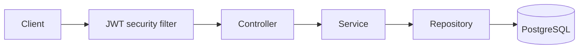

# Task Management API

A Spring Boot REST API for managing users and tasks, with stateless JWT authentication and role-based access control.

This learning project focuses on backend fundamentals: layered design, request validation, database migrations, authentication, authorization, and automated tests.

## Features

- User registration and login
- Password hashing with BCrypt
- Stateless authentication with signed JWTs
- `USER` and `ADMIN` roles
- CRUD endpoints for users and tasks
- Bean Validation for incoming requests
- Structured error responses for validation, authentication, and domain errors
- PostgreSQL schema migrations with Flyway
- Service-layer unit tests with JUnit and Mockito
- Security and authentication integration tests with MockMvc

## Tech Stack

| Area | Technology |
| --- | --- |
| Language | Java 17 |
| Framework | Spring Boot 4 |
| Security | Spring Security, JWT (JJWT) |
| Persistence | Spring Data JPA, PostgreSQL |
| Migrations | Flyway |
| Testing | JUnit, Mockito, MockMvc |
| Build | Gradle |

## Architecture



The API follows a conventional layered structure:

- **Controllers** expose the HTTP endpoints.
- **DTOs** define and validate the API payloads.
- **Services** contain application logic and entity-to-DTO mapping.
- **Repositories** provide persistence through Spring Data JPA.
- **Security components** generate and validate JWTs independently of the controllers.
- **Flyway migrations** build the database schema incrementally.

## Security Model

Registration creates users with the `USER` role. Login returns a signed JWT containing the user's email and role. Protected requests must send the token as a bearer token:

```http
Authorization: Bearer <token>
```

| Access | Endpoints |
| --- | --- |
| Public | `POST /api/auth/register`, `POST /api/auth/login` |
| Authenticated | All user and task endpoints except user deletion |
| `ADMIN` only | `DELETE /api/users/{id}` |

> [!NOTE]
> This repository is a learning project, not a production-ready service. Task access is not yet restricted by ownership: authenticated users can currently read and modify all tasks. The user endpoints are also broadly available to authenticated users, and the create/update DTO currently accepts a role value. These permissions must be tightened before deploying the API publicly.

## API Overview

### Authentication

| Method | Path | Description |
| --- | --- | --- |
| `POST` | `/api/auth/register` | Register a user with the `USER` role |
| `POST` | `/api/auth/login` | Authenticate and receive a JWT |

### Users

| Method | Path | Required access |
| --- | --- | --- |
| `POST` | `/api/users` | Authenticated |
| `GET` | `/api/users` | Authenticated |
| `GET` | `/api/users/{id}` | Authenticated |
| `PUT` | `/api/users/{id}` | Authenticated |
| `DELETE` | `/api/users/{id}` | `ADMIN` |

### Tasks

| Method | Path | Required access |
| --- | --- | --- |
| `POST` | `/api/tasks` | Authenticated |
| `GET` | `/api/tasks` | Authenticated |
| `GET` | `/api/tasks/{id}` | Authenticated |
| `PUT` | `/api/tasks/{id}` | Authenticated |
| `DELETE` | `/api/tasks/{id}` | Authenticated |

## Getting Started

### Prerequisites

- Java 17
- Docker, or a local PostgreSQL instance

### 1. Start PostgreSQL

```bash
docker run --name task-postgres \
  -e POSTGRES_DB=taskdb \
  -e POSTGRES_USER=taskuser \
  -e POSTGRES_PASSWORD=taskpass \
  -p 5434:5432 \
  -d postgres:15-alpine
```

The default application configuration expects PostgreSQL on `localhost:5434` with these development credentials.

### 2. Configure JWT Settings

Set a signing secret of at least 32 bytes and the token lifetime in milliseconds:

```bash
export JWT_SECRET='replace-this-with-a-long-random-secret-key'
export JWT_EXPIRATION='3600000'
```

### 3. Run the API

```bash
./gradlew bootRun
```

The application starts at `http://localhost:8080`. Flyway applies the database migrations automatically.

## Example Flow

Register a user:

```bash
curl -X POST http://localhost:8080/api/auth/register \
  -H 'Content-Type: application/json' \
  -d '{
    "name": "Example User",
    "email": "user@example.com",
    "password": "secret123"
  }'
```

Log in:

```bash
curl -X POST http://localhost:8080/api/auth/login \
  -H 'Content-Type: application/json' \
  -d '{
    "email": "user@example.com",
    "password": "secret123"
  }'
```

Use the returned token to call a protected endpoint:

```bash
curl http://localhost:8080/api/tasks \
  -H 'Authorization: Bearer <token>'
```

## Tests

Start the PostgreSQL container first, then run:

```bash
./gradlew test
```

The test suite includes:

- unit tests for authentication and task service behavior;
- registration and login integration tests;
- security integration tests for `401 Unauthorized`, `403 Forbidden`, and admin-only deletion.

Integration tests use the PostgreSQL configuration in `src/test/resources/application.properties` and therefore expect the development database on port `5434`.

## Project Structure

```text
src/
├── main/
│   ├── java/com/example/taskapi/
│   │   ├── config/
│   │   ├── controller/
│   │   ├── dto/
│   │   ├── entity/
│   │   ├── exception/
│   │   ├── repository/
│   │   ├── security/
│   │   └── service/
│   └── resources/db/migration/
└── test/
    ├── java/com/example/taskapi/
    └── resources/
```

## Author

[Firas Tounsi](https://github.com/firastounsi-ui)
